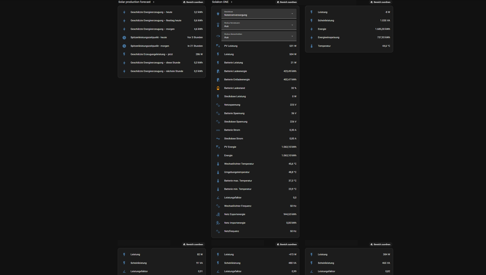

# Home Assistant
Integration und Monitoring einer Photovoltaik-Anlage in meinem Homelab.

## Über das Projekt
Home Assistant läuft als eigener Container auf meinem Proxmox-Server und überwacht meine PV-Anlage in Echtzeit.

## Was ich gemacht habe
- Solakon ONE Wechselrichter/Batteriespeicher eingebunden (Erzeugung, Ladezustand)
- Shelly Pro 3EM zur phasengenauen Energiemessung integriert
- Solarprognose-Integration für vorausschauende Verbrauchsplanung eingerichtet

## Was ich gelernt habe
- Einbindung von Smart-Home-Geräten über Integrationen/APIs
- Auswertung und Visualisierung von Energie-/Sensordaten in Echtzeit
- Umgang mit Energiemesstechnik (Phasenmessung) im Heimnetz

## Verwendete Technologien
- Home Assistant
- Proxmox VE (Container)
- Solakon ONE, Shelly Pro 3EM

## Teil des Homelab
- [Proxmox VE](https://github.com/Criison/Proxmox-VE)
- [AdGuard](https://github.com/Criison/homelab-adguard)
- [Python3 LXC – Pingsweep-Script](https://github.com/Criison/homelab-python3)

## Screenshots

